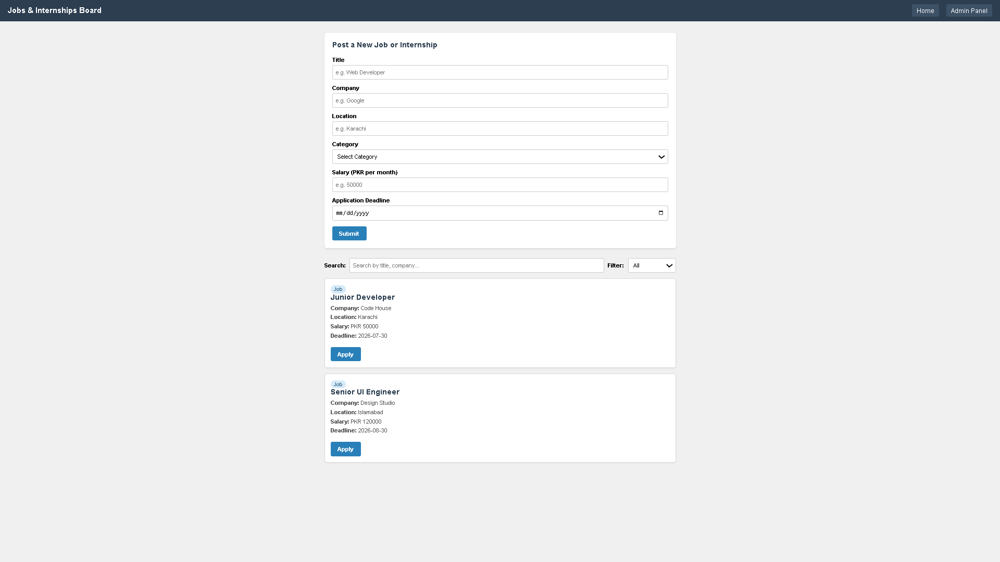
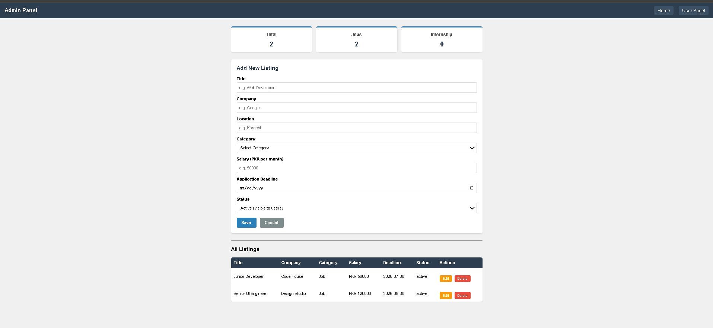

# Jobs & Internships board for students

**Name:** Muhammad Tanveer Jamal  
**Roll Number:** F24BDOCS1M04007

## Description

A modern, responsive web application for students to search, view, and submit jobs and internship opportunities.
The project uses custom CSS styling with a beautiful double-theme aesthetic (User vs. Admin) and handles operations through a local JSON Server REST API.


## Technologies

- **Markup:** HTML5 (Semantic elements: `<nav>`, `<main>`, `<section>`, `<form>`)
- **Styling:** Custom Vanilla CSS (Custom properties, grid & flex layouts, interactive animations)
- **Scripting:** Modern Vanilla JavaScript (Plain JS with `async/await` and `fetch`)
- **Backend:** JSON Server (Mocking RESTful API endpoints)

## Features

### User Panel (`index.html`)
- **Display listings:** View jobs and internships fetched dynamically.
- **Submit positions:** A responsive form to POST new positions with 6 input fields.
- **Inline validation:** Custom field constraints and format validation with inline errors (no browser alert boxes used).
- **Categories filter:** Easily filter listings between Jobs, Internships, or All.
- **Empty state:** Beautiful placeholder information rendered if no opportunities exist.
- **Status handling:** Only shows `Active` opportunities (filtering out administrative hidden items).
- **Loading & Error states:** Visual spinner indicator during fetching, and warning alert banner if the server is unreachable.
## Screenshot



### Admin Panel (`admin.html`)
- **Data registry:** Displays all registered positions (including `Hidden` resources) in a responsive data table.
- **Status visibility toggle:** Mark items as `Active` (visible to users) or `Hidden` (only visible in the admin registry).
- **Manage listing (Edit/Update):** Load existing listing values into the form and update them using `PATCH` requests.
- **Delete opportunity:** Securely remove listings with a confirmation dialog using `DELETE`.
- **Analytics dashboard:** Computes and displays four real-time summary statistics:
  1. Total Listings count
  2. Total Jobs count
  3. Total Internships count
  4. Average Salary (of all listings with numeric values)
- **Branding distinction:** Uses a distinct indigo/slate custom color theme.
## Screenshot


## Run Project

1. **Install JSON Server globally (if not installed):**
   ```bash
   npm install -g json-server
   ```

2. **Start Mock REST API:**
   From the project root folder, start json-server on port 3000:
   ```bash
   npx json-server --watch db.json
   ```

3. **Open client in browser:**
   - User Panel: Open [index.html](./index.html)
   - Admin Panel: Open [admin.html](./admin.html)